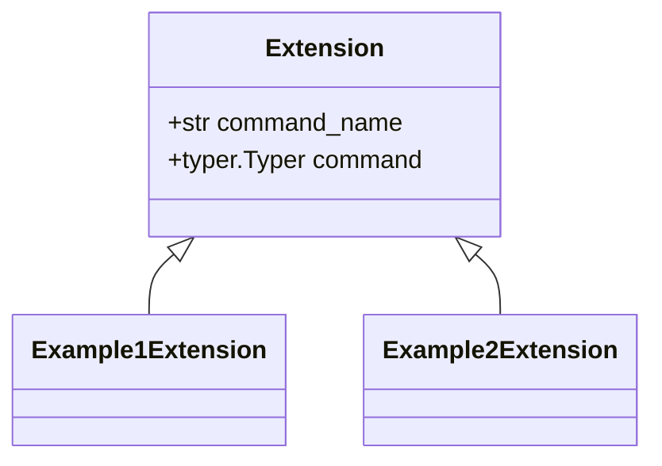

# Extend Gitclone

In order to extend **Gitclone** you can write a Python package which should provide one or more classes implementing the following base class:

<br/><br/><br/>



<br/><br/><br/>

```python
from abc import ABC, abstractmethod

from typer import Typer


class Extension(ABC):
    
    @property
    @abstractmethod
    def command_name(self) -> str:
        ...

    @property
    @abstractmethod
    def command(self) -> Typer:
        ...
```
<br/>


This package should be installed in addition to the base package **gitclone** and you should be ready to go.

The *command_name* should return the name under which the command tree will be provided, e.g. *example* maps to *gitclone example*.

The *command* is a `typer.Typer` object to be registered in the typer object of the commandline interface of **Gitclone**.

You can check the provided example as in [gitclone-example](https://github.com/evyli/gitclone/tree/master/ext/example).